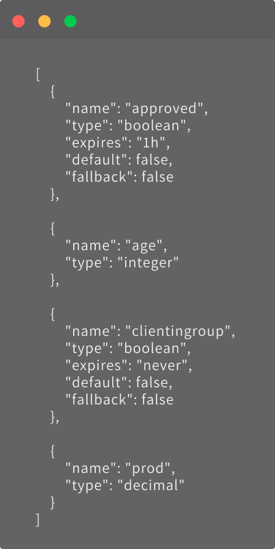
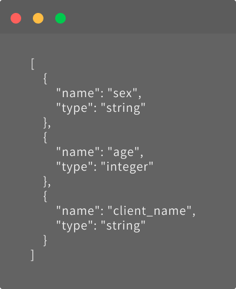
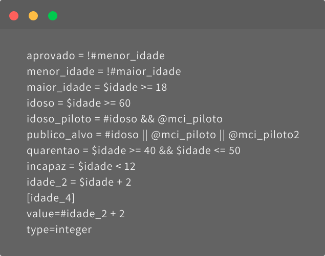
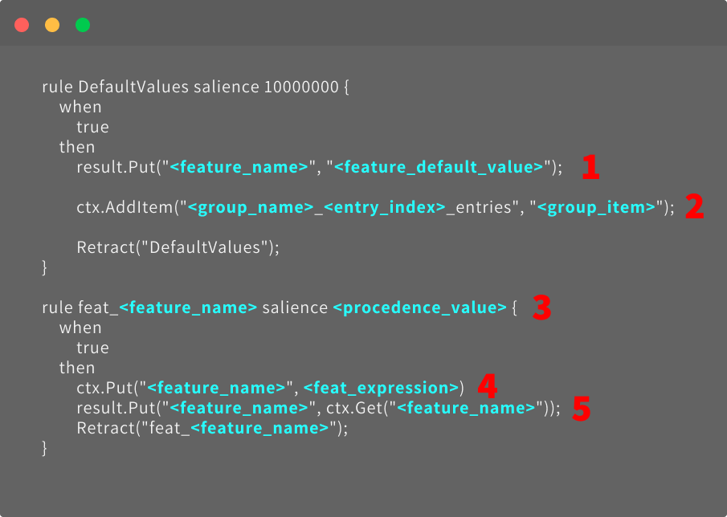

# **Featws Transpiler**

A tool to transpile the FeatWS's files to [GRL format](https://github.com/hyperjumptech/grule-rule-engine/blob/master/docs/en/GRL_en.md). 

## Required Softwares
- node.js version 10 or higher.  
- node package manager (npm).
- You can get an official guide to download this tools [here](https://docs.npmjs.com/downloading-and-installing-node-js-and-npm).

## Initializing the project
- Clone this repository to your local machine.
- Open your local terminal on VScode and type `npm install` to install the required dependencies.
- Go to `example` folder on your local terminal and type `npm start` to run the project.

## Required files

There are three fundamental files for the correct functioning of the transpiler:  

- features.json 
- parameters.json 
- rules.featws

After running the code, the transpiler will seek the content inside these three files to generate the rules file. We describe each of them following this documentation.

### features.json

This is the file where will be described the variables to be calculated. It is necessary to inform some definitions about the feature such as name, type, when it will expire, if it is standard or a fallback. The image below shows some examples of features.



It is important to know that the transpiler can identify a feature directly from the rules.featws file, but keep in mind that its default type is **boolean**. If a feature needs a different type, remember to declare it in features.json file.

#### Extended format

There is another way to describe a feature, and it is using the extended format, like the example below.

 ```
		[age_4] 
		condition = #age2 > 4
		value = #age_2 + 2
		type =integer 
```

You can describe the feature in a similar way it is expressed in features.json and parameter.json files. Note that you can use or not a condition to run your feature. In this case, `age_4` will only be processed if `#age_2` is greater than 4.


### parameters.json

As the features.json, the parameters.json file is responsible for declaring variables. In this case, every information provided as an input needs to be declared in this file.



## What is the rules.featws file 

The rules.featws file is essential for the proper generation of the rules.grl.

It is necessary to understand some points of the file's syntax so that the transpiler can identify the features and parameters inserted in it.

### Special markers

- The `#`identifies the features created in the features.json file.

- The `$` identifies the parameters created in the parameters.json file.

- The `@` identifies a group.

### Math expressions

The rules.featws file is where you can write the logical and mathematical expressions. It is the guide for the transpiler to interpret the written lines and generate the rules file.

You can create all sorts of expressions and calculations, as shown in the image below.



Feel free to use logical and mathematical operators, variables dependent on other variables and groups according to your needs.

## Building groups

- To build groups in ``featws-tranpiler`` you need at first to stay in a folder with the files: (You can easily copy from simple_group folder inside example folder)

    - features.json
    - parameters.json
    - package.json
    - package-lock.json
    - rules.featws

- **Keep in mind that these files will change in the way that you change the objectives**. Now you have to create inside this folder a new folder called ``groups`` and inside that is the local that you will put your groups. Here's an example of a simple group:

    ```json
        {
            "{$branch}/{$account}": ["00000/00000000"]
        }
    ```

- After that you need to set your ``parameters.json`` file setting the parameters that should been used in the previous group:

    ~~~json
    [
        {
            "name": "branch",  
            "type": "integer"  
        },
        {
            "name": "account",
            "type": "integer" 
        }
    ]
    ~~~

- Now you can give an alias for ``mygroup`` group, an this name will be defined on ``features.json`` file, like that:

    ```json
        [
            {
                "name": "clientingroup", 
                "type": "boolean",                
                "default": false,         
                "fallback": false
            }
        ]
    ```

- The Last step is set a rule to achieve your goal and we do that on ``rules.featws`` file, like that:

    ```
        clientingroup = @mygroup # setting our feature name to our group 
        
        # this action is too much simple, but already shows how to work 
        # with groups
    ```

- To finish the project you just need to run on your local terminal the comand:

    ~~~shell
        # this command will generate the .grl file that will be interpreted
        # by our project "featws-ruller"

        npx featws-transpiler
   ~~~

## Test Cases

At some point, you may need to test new cases to generate rules. To do this, go to the `__tests__/cases` directory and create a new test folder. 
Inside it, create the files parameters.json, featres.json, and rules.featws. If you need a group, create a new `groups` folder as in the steps described above. After all the essential files are filled in, we recommend creating the `expected.grl` file manually so you compare it with the rules file generated by the transpiler. 

### The expected.grl file

We use this file to make sure the transpiler generated the rules.grl correctly. The rules file has its own syntax as we demonstrate below.



1. **feature_name** and **deature_default_value**: The name and value of the boolean feature that has False or True as default is inserted in this line. If the feature does not have a default value, this line should not be written.

2. **group_name**, **entry_index**, and **group_item**: Group name, index entry value (usually 0), and the group item. This line must be inserted for each item within a group.

3. **feature_name** and **procedence_value**: Name of the feature to be calculated and its resolution priority value. The higher the precedence value, the higher the priority. Ex: in 2 + (3 + 4) the expression (3 + 4) has greater precedence than 2 + (). The name of this feature will be repeated in lines 4 and 5.

4. **feat_expression**: Feature resolution according to its type and related values. See exemples above:
`ctx.GetInt("mynumber") < 12` at test 0001.
`result.GetBool("mygroup")` at test 0003.
`ctx.GetString("gender") == "F"` at test 0004.
`ctx.GetInt("age") * ctx.GetInt("age") + ""` at test 0025.
You can check more exemples inside test cases folder.

5. This line saves the result in the features variable.


### Running a test

To run the test, type `npx featws-transpiler` at the terminal inside the test folder, and the rules files will be generated.

We show how to configure the `npx featws-transpiler` command in the subsequent topic.

## Using npm link

- When you use `npm link` you are able to work and test interatively without having to continually rebuild the project. You can get more offical information about the package [here](https://docs.npmjs.com/cli/v8/commands/npm-link).

- In this project we have to do this steps:

    - At First, you should verify if you have the featws-transpiler package already installed on the project by this command on local terminal:

        ~~~shell
        npm list -g featws-transpiler
        ~~~

    - If it's installed, you should to run this command to remove the package:

        ~~~shell
        npm rm --global featws-transpiler
        ~~~

    - Now you're ableled to link the featws-transpiler project doing this:

        ~~~shell
        cd ~/projects/featws-transpiler # go to your project location
        npm link featws-transpiler      # link-install the package
        ~~~

## Using npx to run packages

- ``npx command`` allows you to run binaries from npmjs library either installed locally or fetched remotely, in a similar context as run with ``npm run``. You can get more offical information about the command [here](https://docs.npmjs.com/cli/v8/commands/npx).

- This command is very useful when you want to run, for example, the ``featws-transpiler`` package, to generate the transpilation of your rules into a ``.grl`` file.

- Once you finish your folder configuration, go to these same folder and run:
     ~~~
        # go to your folder location

        cd ~/projects/featws-transpiler/example/simple_group 

        # if you don't installed the package, the command will do that for you 
        # if you already did, the commando will run the package 

        npx featws-transpiler
    ~~~
